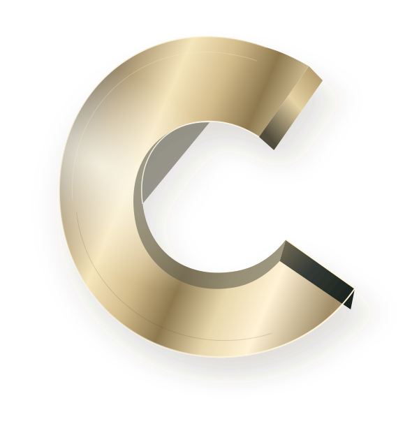
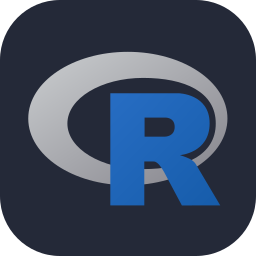
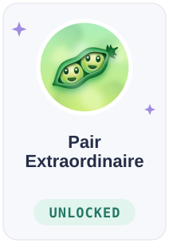
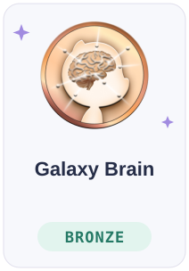
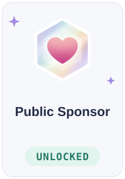
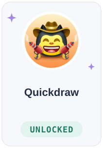
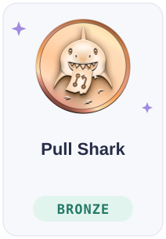
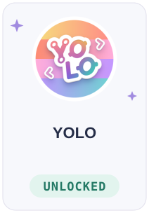

   
  <strong>Custard</strong>

<h1 align="center">PhD Researcher in Artificial Intelligence</h1>

  AI agent reliability · Reproducible research 
  Bachelor's &amp; Master's in Data Science

  <a href="https://custard.top/en">Website</a> ·
  <a href="#user-content-selected-projects">Selected work</a> ·
  <a href="#user-content-shipped-upstream">Open-source contributions</a> ·
  <a href="#user-content-github-achievements">Achievements</a>

  
  
  
  
  
  
  
  
  

  
   
  Across all public repositories, including forks · Updated daily

### GitHub achievements

  <picture>
    <source media="(max-width: 600px)" srcset="./assets/profile/achievement-shelf-mobile.svg" />
    
  </picture>

<!-- earned-achievements:start -->

  
  
  
  
  
  

<a href="https://github.com/Muguett-DBY?tab=achievements">Earned on GitHub</a> · Updated daily

<!-- earned-achievements:end -->

### Selected projects

  <picture>
    <source media="(max-width: 600px)" srcset="./assets/profile/projects-workshop-mobile.svg" />
    
  </picture>

  <a href="https://hireway.custard.top"><picture><source media="(max-width: 600px)" srcset="./assets/projects/cards/hireway-mobile.svg" /></picture></a> 
  
  

  
See HireWay in action

  <picture><source media="(prefers-reduced-motion: reduce)" srcset="./assets/projects/hireway-home.png" /></picture>

  <a href="https://shoot.custard.top"><picture><source media="(max-width: 600px)" srcset="./assets/projects/cards/photography-mobile.svg" /></picture></a> 
  
  

  <a href="https://custard.top/en"><picture><source media="(max-width: 600px)" srcset="./assets/projects/cards/custard-web-mobile.svg" /></picture></a> 
  
  

  <a href="https://github.com/Muguett-DBY/veilreach-mod"><picture><source media="(max-width: 600px)" srcset="./assets/projects/cards/veilreach-mobile.svg" /></picture></a> 
  <a href="https://github.com/Muguett-DBY/veilreach-mod">Explore Veilreach ↗</a>

Website screenshots and original concept artwork · <a href="./CREDITS.md#public-project-previews">Preview details</a>.

  
Earlier work: CalmJourney

An archived city-travel project about quieter spaces and crowd insights. The source is kept for reference; the backend is paused.

[Explore the source archive ↗](https://github.com/Muguett-DBY/CalmJourney)

### Shipped upstream

  <picture>
    <source media="(max-width: 600px)" srcset="./assets/profile/upstream-logbook-mobile.svg" />
    
  </picture>

<table>
  <tr>
    <td width="56" valign="middle"></td>
    <td valign="middle"><strong><a href="https://github.com/pandas-dev/pandas-stubs">pandas-stubs</a></strong> 
      <a href="https://github.com/pandas-dev/pandas-stubs/pull/2048">Series windows</a> ·
      <a href="https://github.com/pandas-dev/pandas-stubs/pull/2053">NumPy minimum</a> ·
      <a href="https://github.com/pandas-dev/pandas-stubs/pull/2070">ty type checks</a></td>
  </tr>
  <tr>
    <td width="56" valign="middle"></td>
    <td valign="middle"><strong><a href="https://github.com/python-pillow/Pillow">Pillow</a></strong> 
      <a href="https://github.com/python-pillow/Pillow/pull/10328">CMYK and keep_rgb MPO saving</a> · <a href="https://github.com/python-pillow/Pillow/pull/10300">CI check names</a> (co-authored)</td>
  </tr>
  <tr>
    <td width="56" valign="middle"></td>
    <td valign="middle"><strong><a href="https://github.com/MaciejZiel/pytest-queryguard">pytest-queryguard</a></strong> 
      <a href="https://github.com/MaciejZiel/pytest-queryguard/pull/210">ASGI mounts</a> · <a href="https://github.com/MaciejZiel/pytest-queryguard/pull/211">WSGI file responses</a> · <a href="https://github.com/MaciejZiel/pytest-queryguard/pull/202">Stable query timing</a> · <a href="https://github.com/MaciejZiel/pytest-queryguard/pull/203">WSGI query attribution</a></td>
  </tr>
  <tr>
    <td width="56" valign="middle"></td>
    <td valign="middle"><strong><a href="https://github.com/nmloc/gh-achievements">gh-achievements</a></strong> 
      <a href="https://github.com/nmloc/gh-achievements/pull/6">More reliable badge detection</a></td>
  </tr>
  <tr>
    <td width="56" valign="middle"></td>
    <td valign="middle"><strong><a href="https://github.com/stats-organization/github-stats-extended">GitHub Stats Extended</a></strong> 
      <a href="https://github.com/stats-organization/github-stats-extended/pull/679">Clarify cache duration</a></td>
  </tr>
  <tr>
    <td width="56" valign="middle"></td>
    <td valign="middle"><strong><a href="https://github.com/zoltanf/extrudo">Extrudo</a></strong> 
      <a href="https://github.com/zoltanf/extrudo/pull/131">Check attachment limits</a></td>
  </tr>
</table>

### A little city, built one contribution at a time

  <picture>
    <source media="(max-width: 600px)" srcset="./assets/profile/activity-atlas-mobile.svg" />
    
  </picture>

  

<!-- city-breakdown:start -->

  <strong>5,391</strong>&nbsp;commits ·
  <strong>14</strong>&nbsp;issues&nbsp;opened ·
  <strong>83</strong>&nbsp;PRs&nbsp;opened ·
  <strong>94</strong>&nbsp;reviews ·
  <strong>46</strong>&nbsp;repos&nbsp;created

<!-- city-breakdown:end -->

GitHub activity shown on my profile over the past year · Updated daily · Generated <!-- city-date -->2026-11-14<!-- /city-date -->. Colours adapt to light and dark themes.

  <picture>
    <source media="(prefers-color-scheme: light)" srcset="./assets/contribution-snake-light.svg" />
    
  </picture>

A little contribution arcade · Snapshot <!-- snake-date -->2026-11-05<!-- /snake-date -->

  
More from my GitHub workshop: statistics

  
  

Cards generated on <!-- cards-date -->2026-11-05<!-- /cards-date -->. Total PRs are all-time; commits cover the last year. Language shares describe repository code, not skill levels.

### Keep exploring

  
  
  

<a href="./docs/REUSE_PROFILE.md">Reuse the profile widgets</a> · <a href="https://github.com/Muguett-DBY/Muguett-DBY/issues">Report a profile issue</a>

  <picture>
    <source media="(max-width: 600px)" srcset="./assets/profile/workshop-footer-mobile.svg" />
    
  </picture>

  
Made with a little help from open source

Technology icons by [Skill Icons](https://github.com/tandpfun/skill-icons). Contribution city by [GitHub Profile 3D Contrib](https://github.com/yoshi389111/github-profile-3d-contrib). Additional artwork uses [GitHub Stats Extended](https://github.com/stats-organization/github-stats-extended), [Snake](https://github.com/Platane/snk), [Readme Typing SVG](https://github.com/DenverCoder1/readme-typing-svg), and [Capsule Render](https://github.com/kyechan99/capsule-render). See [credits and license notices](./CREDITS.md).

Original code is available for noncommercial use under [PolyForm Noncommercial 1.0.0](LICENSE). See [license scope and third-party assets](docs/LICENSE_SCOPE.md).
